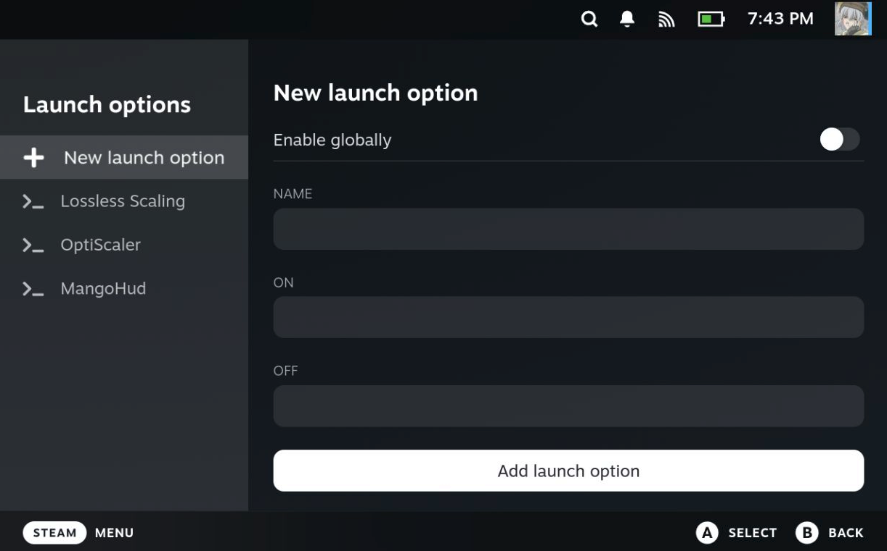
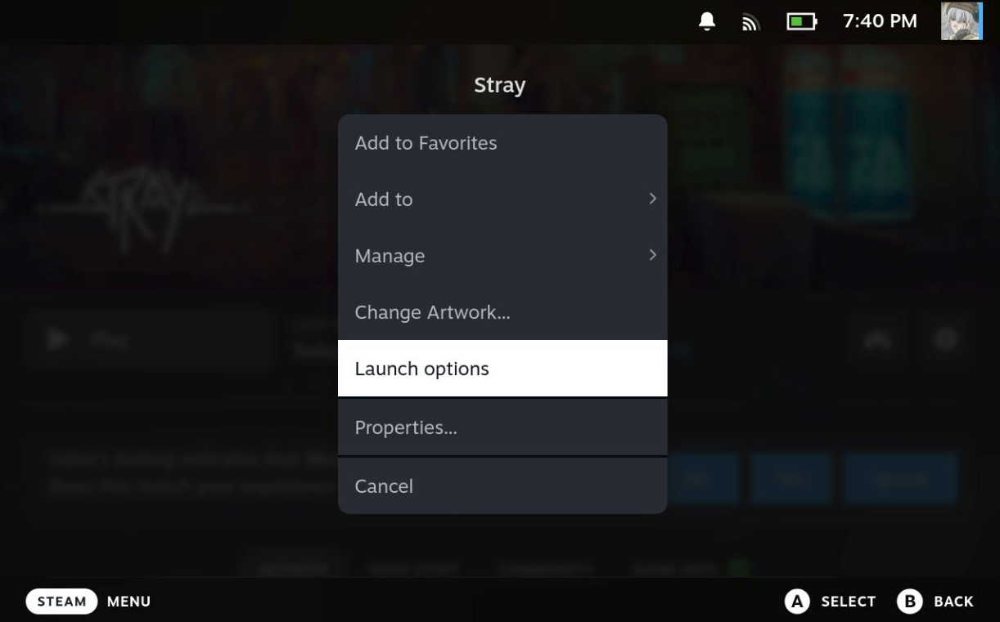

<h1 align="center">
   Decky Launch Options
</h1>

<p align="center">
   Manage launch options for your games with ease 🍃
</p>


## Features

- [x] Manage all your most used launch options in one place
- [x] Enable or disable launch options per game
- [x] Enable launch options globally for all games
- [x] Supports different behaviors when a launch option is on or off

## Table of Contents

- [Installation](#installation)
- [How to use](#how-to-use)
- [Recipes](#recipes)
- [Integration with Third-Party plugins](#integration-with-third-party-plugins)
- [Understanding launch options](#understanding-launch-options)
- [Philosophy](#philosophy)
- [Development](#development)

## Installation

* [Download](https://github.com/Wurielle/decky-launch-options/releases) `decky-launch-options.zip` and import it
  in Decky Loader
* Or copy the link to `decky-launch-options.zip` and import it in Decky Loader

> **Note:** You might need to enable `Developer mode` in the Decky Loader settings

## How to use

### 1. Create a launch option

Open the plugin tab to manage your launch options and create a new launch option.

* **Name** — A label to identify the launch option (e.g. "MangoHud", "Steam Deck mode")
* **Enable globally** — When enabled, this launch option will be enabled by default for all games
* **On command** — The launch option script that is applied when the toggle is **switched on**
* **Off command** — The launch option script that is applied when the toggle is **switched off**




> **Example:** For a "Steam Deck mode" launch option, you could set:
> * **On command:** `SteamDeck=1 %command%` — forces Steam Deck compatibility
> * **Off command:** `SteamDeck=0 %command%` — explicitly disables it
>
> If you only need something applied when enabled (e.g. MangoHud), you can leave the **Off command** empty or vice
> versa:
> * **On command:** `mangohud %command%`
> * **Off command:** *(empty)*

### 2. Toggle launch options per game

On your game page, click on settings and click on **Launch options**.




You can enable or disable launch options to your liking.
Each launch option is a **switch**. When you turn it on for a game, the **On command** is used.
When you turn it off, the **Off command** is used instead.

* **Locally enabled** launch options are opt-in — they are off by default and you can enable them if you need them
* **Globally enabled** launch options are opt-out — they are on by default and you can disable them if you don't need
  them
* If you already had launch options before, they will be placed in the "Original launch options" field and will be
  executed normally. It is recommended to remove the original launch options once you have configured all your launch
  options with the plugin.

## Recipes

Decky Launch Options does not come with a pre-defined set of launch options.

If you wish to import a pre-defined set of
launch options to quickstart your use of this plugin or create your own
collection that you can share with others, I recommend checking out
the [Decky Launch Options Recipes](https://github.com/Wurielle/decky-launch-options-recipes)
plugin.

## Integration with Third-Party plugins

If you're a plugin developer and would like to offer an easy one-click button to add your plugin's launch options via
Decky Launch Options, you can do so by dispatching the `dlo-add-launch-options` custom event:

```typescript
window.dispatchEvent(new CustomEvent('dlo-add-launch-options', {
    detail: [
        {
            id: 'portal-args',
            name: 'Portal args',
            on: '-novid +cl_showfps 3',
            off: '',
            enableGlobally: false,
        },
        {
            id: 'mangohud-command',
            name: 'MangoHud command',
            on: 'mangohud %command%',
            off: '',
            enableGlobally: false,
        },
        {
            id: 'steam-deck-env',
            name: 'Steam Deck env',
            on: 'SteamDeck=1',
            off: 'SteamDeck=0',
            enableGlobally: true,
        },
    ]
}));
```

This will prompt the user to review and confirm the provided launch options.

You can also check if Decky Launch Options is available with:

```typescript
(window as any).hasDeckyLaunchOptions
```

> **Note:** Every field of a launch option is optional but I recommend at least setting a static id for each one to
> allow Decky Launch Options to override launch options with matching ids in case the user decides to import them again.

## Understanding launch options

Decky Launch Options tries to simplify launch options management by offering a degree of leeway in how you can structure
your launch options but it's still important to understand how launch options work to avoid mistakes!

### The `%command%` Placeholder

The `%command%` placeholder represents where your game executable will be inserted in the command chain. Everything
before `%command%` becomes a **prefix** (executed before the game), and everything after becomes a **suffix** (passed as
arguments to the game).

**Structure example:**

```
[ENV_VARS] [PREFIX_COMMANDS] %command% [GAME_ARGUMENTS]
```

### Simple Examples

Here are recipes for common launch option scenarios.

> **Note:** Please provide `%command%` whenever you can to assure proper detection of command parts. This will also help
> readbility.

**Environment variables:**

```bash
SteamDeck=1 Foo="Bar baz" %command%
```

**Prefix command:**

```bash
mangohud %command%
```

**Game arguments:**

```bash
%command% -novid +cl_showfps 3
```

**Environment variables + prefixes + game arguments:**

```bash
SteamDeck=1 Foo="Bar baz" ~/lsfg mangohud %command% -novid +cl_showfps 3
```

### How Decky Launch Options handle multiple launch options

When multiple launch options are enabled, they are combined like so:

1. **All environment variables** are collected and applied
2. **All prefix commands** are chained together
3. **All game arguments** are concatenated and passed to the game

**With two launch options enabled:**

1. `SteamDeck=0 mangohhud %command% -novid`
2. `~/lsfg %command% +cl_showfps 3`

**We get:**

```bash
SteamDeck=0 ~/lsfg mangohud path/to/game -novid +cl_showfps 3
```

## Philosophy

This plugin is part one of my desire to make the best HTPC/Handheld experience easier to access for anyone using Big
Picture.

My HTPC uses a RDNA 3 GPU and frankly it bothers me immensely that AMD won't support FSR4 officially on my card, or on
my
Steam Deck.
Thankfully, thanks to the people working on OptiScaler, it's possible to mod FSR4 in games that support DLSS, XeSS or
FSR3 and it's a huge quality boost!

Modding OptiScaler/Lossless Scaling in games on the Steam Deck is usually done by using launch options which is not very
intuitive for an average user or someone new to PC Gaming (or even me even though I've been working with PCs for most
of my life now).

There's a UX problem for the average user when it comes to interacting with launch options and I don't blame anyone for
it. It's just tedious having to work
with them on handheld or controller.

At the end of the day, an average user simply wants to toggle features for a game easily or even better have them
available by default for ALL
games. That's what I aim to solve with this plugin.

Now, being able to enable/disable features quickly is already a huge step. Ideally, what comes next is a way to enable,
disable or edit features from an interface similar to AMD's Adrenalin software. I already tried to achieve something
similar on Windows with Auto Lossless Scaling for an easier Lossless Scaling integration. I think it can be done thanks
to the work of the Open Source community. My goal is to streamline the process and give Steam Big Picture the tools to
offer the best experience
to play games on regardless of your GPU.

## Development

This project uses [just](https://github.com/casey/just) as an IDE-agnostic task runner.

### Pre-requisites:

* [Docker Engine](https://docs.docker.com/engine/install/)
* [pnpm](https://pnpm.io/installation#using-npm)
* [just](https://github.com/casey/just)

1. **Configure deployment settings**

   Copy `.env` to `.env.local` and update with your Steam Deck details:
   ```bash
   cp .env .env.local
   ```
   Edit `.env.local` to match your Steam Deck's IP, user, etc.

1. **Set up SSH key authentication (to avoid password prompts)**
   ```bash
   # Generate SSH key if you don't have one
   ssh-keygen -t rsa -b 4096
   
   # Copy your SSH key to the Steam Deck (enter password once)
   ssh-copy-id -p <DECK_PORT> <DECK_USER>@<DECK_IP>

   # Add your SSH key to ssh-agent (run once per session)
   eval "$(ssh-agent -s)"
   ssh-add ~/.ssh/id_rsa
   ```

### Available commands

- `just` - List all available commands

### Debugging

* [Chrome Inspect](chrome://inspect/#devices)
    * Discover network targets
        * <DECK_IP>:8081

---
