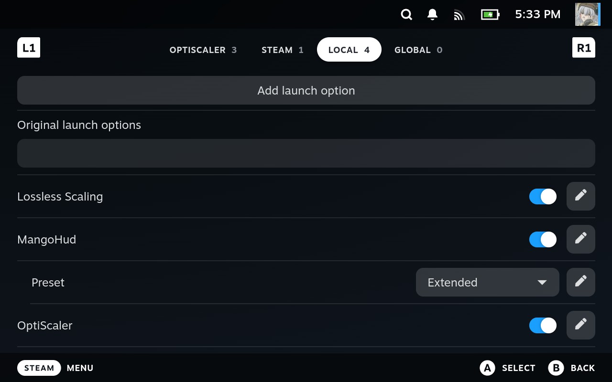
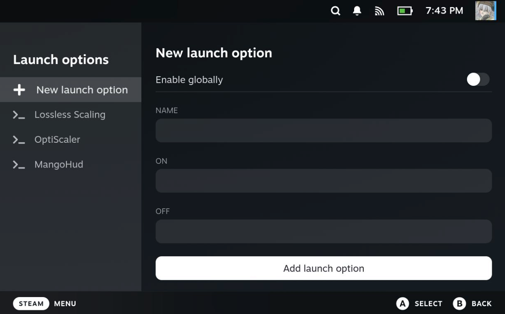
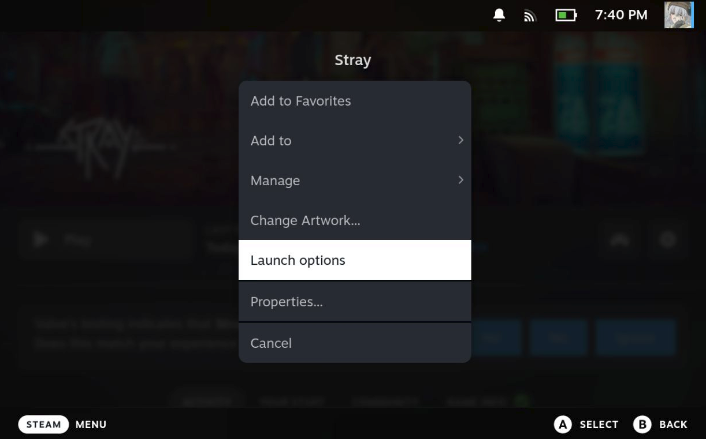
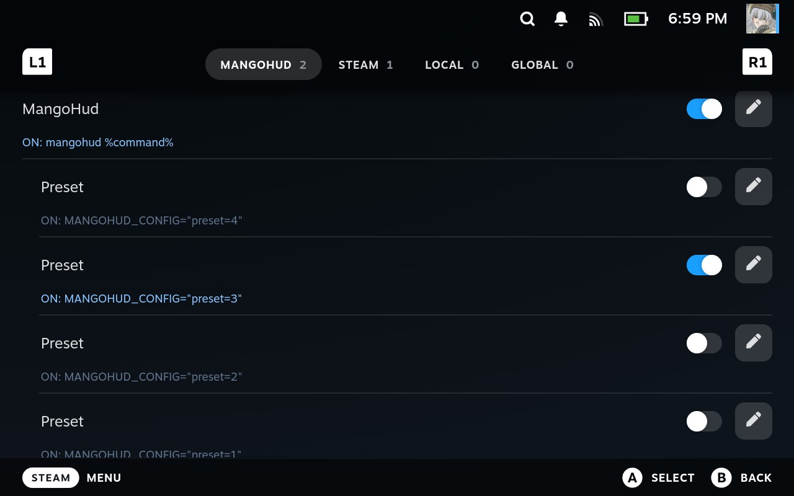
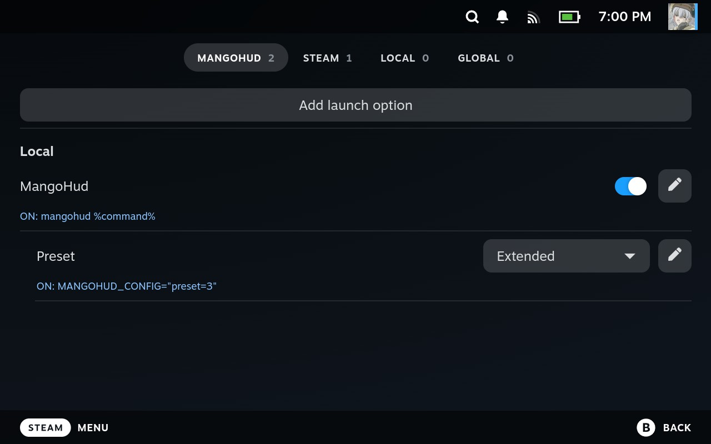
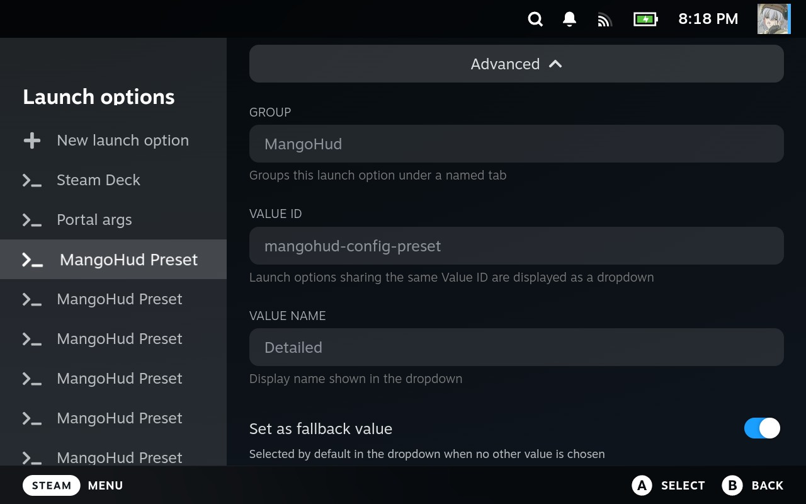

<h1 align="center">
   Decky Launch Options
</h1>

<p align="center">
   Manage launch options for your apps with ease 🍃
</p>



## Features

- [x] Manage all your most used launch options in one place
- [x] Enable or disable launch options per app
- [x] Enable launch options globally for all apps
- [x] Supports different behaviors when a launch option is on or off

## Table of Contents

- [Installation](#installation)
- [Recipes](#recipes)
- [How to use](#how-to-use)
    - [Add a new tab](#add-a-new-tab)
    - [Add a dropdown](#add-a-dropdown)
    - [Add an Environment Variable Merge](#add-an-environment-variable-merge)
    - [Change execution priority](#change-execution-priority)
    - [Advanced commands](#advanced-commands)
        - [Wrapper script with `--`](#wrapper-script-with---)
        - [Setup script with `&&`](#setup-script-with-)
        - [Inline wrapper script with `--`](#inline-wrapper-script-with---)
        - [Inline setup script with `&&`](#inline-setup-script-with-)
- [Integration with Third-Party plugins](#integration-with-third-party-plugins)
- [Understanding launch options](#understanding-launch-options)
- [Philosophy](#philosophy)
- [Development](#development)

## Installation

* [Download](https://github.com/Wurielle/decky-launch-options/releases) `decky-launch-options.zip` and import it
  in Decky Loader
* Or copy the link to `decky-launch-options.zip` and import it in Decky Loader

> **Note:** You might need to enable `Developer mode` in the Decky Loader settings


## Recipes

Decky Launch Options does not come with a pre-defined set of launch options [by design](https://github.com/Wurielle/decky-launch-options/issues/48).

If you wish to import a pre-defined set of
launch options to quickstart your use of this plugin or create your own
collection that you can share with others, I recommend checking out
the [Decky Launch Options Recipes](https://github.com/Wurielle/decky-launch-options-recipes)
plugin.

## How to use

### 1. Create a launch option

Open the plugin tab to manage your launch options and create a new launch option.



* **Name** — A label to identify the launch option (e.g. "MangoHud", "Steam Deck mode")
* **Enable globally** — When enabled, this marks the launch option as opt-out: the on command will run automatically for all apps
* **On command** — The command that runs when the toggle is **switched on**, the launch option is enabled globally or the launch option is selected in a dropdown
* **Off command** — The command that runs when the toggle is **switched off**

> **Example:** For a "Steam Deck mode" launch option, you could set:
> * **On command:** `SteamDeck=1 %command%` — forces Steam Deck compatibility
> * **Off command:** `SteamDeck=0 %command%` — disables Steam Deck compatibility
>
> If you only need to run a command when enabled (e.g. MangoHud), you can leave the **Off command** empty or vice
> versa:
> * **On command:** `mangohud %command%`
> * **Off command:** *(empty)*

### 2. Toggle launch options per app

On your app page, click on the settings button and click on **Launch Options**.




You can enable or disable launch options to your liking.
Each launch option is a **switch**. When you turn it on for an app, the **On command** is used.
When you turn it off, the **Off command** is used instead.

* **Locally enabled** launch options are opt-in — they are off by default and you can enable them if you need them
* **Globally enabled** launch options are opt-out — they are on by default and you can disable them if you don't need
  them
* If you already had launch options before, they will be placed in the "Original launch options" field and will be
  executed normally. It is recommended to remove the original launch options once you have configured all your launch
  options with the plugin.

### Add a new tab

- Use the same `Group` name for every launch option that should appear in the same tab


### Add a dropdown

Launch options can also appear in a dropdown. This is preferrable when multiple launch options target a singular change.

<table>
  <tr>
    <td align="center"><strong>Before</strong></td>
    <td align="center"><strong>After</strong></td>
  </tr>
  <tr>
    <td></td>
    <td></td>
  </tr>
</table>

For each launch option that should appear in a dropdown:

- Use the same `Value ID`
- Use the same `Name`
- Use a unique `Value Name` shown in the dropdown
- Set `Fallback Value` to `On` on a launch option to use it as the default value



### Add an Environment Variable Merge

Some environment variables accept multiple joined values. If several launch options set the same variable, you can configure
a merge so their values are joined instead of one overriding another.

Open **Manage env variable merges** in the plugin and add a **New merge**:

- **Environment variable name** — The exact variable name, such as `MANGOHUD_CONFIG`.
- **Delimiter** — The separator that variable expects, such as `,` for `MANGOHUD_CONFIG` or `;` for `WINEDLLOVERRIDES`.

For example, with `MANGOHUD_CONFIG` configured to merge using `,`, these two enabled launch options:

```bash
MANGOHUD_CONFIG="cpu_temp" %command%
MANGOHUD_CONFIG="gpu_temp" %command%
```

produce a combined value of `MANGOHUD_CONFIG="cpu_temp,gpu_temp"`. Only configure merges for variables that support
multiple values, and use the delimiter expected by the program reading the variable.

### Change execution priority

Each launch option has a numeric **Priority** field which defaults to `0`.
Increase it to run a prefix command earlier, or decrease it to place the command closer to `%command%`. Negative values
are allowed. Higher values run first.

For example, enabling these options:

| On command | Priority |
|------------|----------|
| `gamescope -f -- %command%` | `10` |
| `mangohud %command%` | `-10` |

produces:

```bash
gamescope -f -- mangohud %command%
```

Priority also resolves conflicts between environment variables that are **not configured to merge**. If one option sets
`SteamDeck=0 %command%` with priority `0` and another sets `SteamDeck=1 %command%` with priority `10`, the higher-priority
value wins: `SteamDeck=1`. Variables configured to merge have their values joined using their configured delimiter.

### Advanced commands

Use a wrapper with `--` when your script should launch the app, or a setup command followed by `&&` when the app
should start after the command succeeds. You can use a script file or a short inline `bash -c` command.

> **Warning:** Always include `%command%` when using a custom script or command in a launch option. It identifies where
> the app belongs and lets the plugin distinguish the script's arguments from the app's arguments.

The script file examples invoke `bash` explicitly, so the files do not need executable permissions.

#### Wrapper script with `--`

Save this as `~/scripts/launch-app.sh`:

```bash
#!/usr/bin/env bash
set -e

# Read this script's required profile argument, then the -- separator.
profile="$1"
shift
if [[ "$1" != "--" ]]; then
    printf 'Usage: launch-app.sh PROFILE -- COMMAND [ARG...]\n' >&2
    exit 1
fi
shift

printf 'Launching with profile: %s\n' "$profile" >> ~/app-launch.log
exec "$@"
```

Set the **On command** to:

```bash
bash ~/scripts/launch-app.sh handheld -- %command%
```

Here, `handheld` is the script's profile argument. The script consumes it and `--`, leaving the app command and its
arguments in `"$@"`. The `--` separator does not launch the app by itself: the wrapper must use `exec "$@"` to hand
control to the remaining command. Keep the quotes so arguments containing spaces are preserved.

#### Setup script with `&&`

Save this as `~/scripts/prepare-app.sh`:

```bash
#!/usr/bin/env bash
set -e

profile="$1"
printf 'Preparing profile: %s\n' "$profile" >> ~/app-launch.log
```

Set the **On command** to:

```bash
bash ~/scripts/prepare-app.sh handheld && %command%
```

This script receives only its own `handheld` argument. After it exits successfully, `&&` allows the app to start.
If the script fails, the app will not start. This version does not need `exec "$@"` because the app command is outside
the script.

#### Inline wrapper script with `--`

Set the **On command** to:

```bash
bash -c 'printf "Starting app\n"; exec "$@"' -- %command%
```

With `bash -c`, the first argument after the script becomes `$0`. Here, `--` fills that slot, leaving the app command
and its arguments in `"$@"`. Keep `exec "$@"` so the wrapper actually launches the app.

#### Inline setup script with `&&`

Set the **On command** to:

```bash
bash -c 'printf "Preparing profile: %s\n" "$1"' -- handheld && %command%
```

Here, `--` again fills `$0`, and `handheld` becomes `$1`. The app starts after the inline script succeeds, so this
version does not need `exec "$@"`.

## Integration with Third-Party plugins

If you're a plugin developer and would like to offer an easy one-click button to add your plugin's launch options via
Decky Launch Options, you can do so by dispatching the `dlo-add-launch-options` custom event:

```typescript
window.dispatchEvent(new CustomEvent('dlo-add-launch-options', {
    detail: [
        {
            id: 'portal-args',
            name: 'Portal args',
            on: '-novid +cl_showfps 3',
            off: '',
            enableGlobally: false,
        },
        {
            id: 'mangohud-command',
            name: 'MangoHud command',
            on: 'mangohud %command%',
            off: '',
            enableGlobally: false,
        },
        {
            id: 'steam-deck-env',
            group: 'Steam Utils',
            name: 'Steam Deck env',
            on: 'SteamDeck=1',
            off: 'SteamDeck=0',
            enableGlobally: true,
        },
    ]
}));
```

This will prompt the user to review and confirm the provided launch options.
You can also check if Decky Launch Options is available with:

```typescript
(window as any).hasDeckyLaunchOptions
```

### `LaunchOption` properties:

| Property         | Type      | Description                                                                                                |
|------------------|-----------|------------------------------------------------------------------------------------------------------------|
| `id`             | `string`  | Stable unique identifier used to select values and update the launch option during reimport.               |
| `name`           | `string`  | Display label shown in the UI.                                                                             |
| `on`             | `string`  | Command that is run when the launch option is enabled.                                                  |
| `off`            | `string`  | Command that is run when the launch option is disabled.                                                 |
| `enableGlobally` | `boolean` | Mark the launch option as opt-out: this makes the on command run automatically for all apps.                                                                    |
| `group`          | `string`  | Group name that creates a new tab in the UI.                                                               |
| `valueId`        | `string`  | Shared identifier that groups launch options into a dropdown.                                              |
| `valueName`      | `string`  | Display name shown for the dropdown value in the UI.                                                       |
| `fallbackValue`  | `boolean` | Mark as default value for its `valueId` dropdown.                                                               |
| `priority`       | `number`  | Execution priority for the launch option. Higher values run first; negative values run closer to %command% |

> **Note:** Every property of a launch option is optional but I recommend at least setting a static id for each one to
> allow Decky Launch Options to override launch options with matching ids in case the user decides to import them again.

### Example: add a new tab

```typescript
window.dispatchEvent(new CustomEvent('dlo-add-launch-options', {
    detail: [
        {
            id: 'steam-deck-env',
            group: 'Steam',
            name: 'Steam Deck',
            on: 'SteamDeck=1',
            off: 'SteamDeck=0',
            enableGlobally: true,
        },
        {
            id: 'mangohud',
            group: 'MangoHud',
            name: 'MangoHud',
            on: 'mangohud %command%',
            off: '',
            enableGlobally: false,
        },
    ]
}));
```

### Example: add a dropdown

```typescript
window.dispatchEvent(new CustomEvent('dlo-add-launch-options', {
    detail: [
        {
            id: 'mangohud-config-preset-none',
            group: 'MangoHud',
            name: 'MangoHud Preset',
            on: '',
            enableGlobally: false,
            valueId: 'mangohud-config-preset',
            valueName: 'None',
            fallbackValue: true,
        },
        {
            id: 'mangohud-config-preset-1',
            group: 'MangoHud',
            name: 'MangoHud Preset',
            on: 'MANGOHUD_CONFIG="preset=1"',
            enableGlobally: false,
            valueId: 'mangohud-config-preset',
            valueName: 'FPS Only',
        },
        {
            id: 'mangohud-config-preset-4',
            group: 'MangoHud',
            name: 'MangoHud Preset',
            on: 'MANGOHUD_CONFIG="preset=4"',
            enableGlobally: false,
            valueId: 'mangohud-config-preset',
            valueName: 'Detailed',
        },
    ]
}));
```

## Understanding launch options

Decky Launch Options tries to simplify launch options management by offering a degree of leeway in how you can structure
your launch options but it's still important to understand how launch options work to avoid mistakes!

### The `%command%` Placeholder

The `%command%` placeholder represents where your app executable will be inserted in the command chain. Everything
before `%command%` becomes a **prefix** (executed before the app), and everything after becomes a **suffix** (passed as
arguments to the app).

**Structure example:**

```
[ENV_VARS] [PREFIX_COMMANDS] %command% [APP_ARGUMENTS]
```

### Simple Examples

Here are recipes for common launch option scenarios.

> **Note:** Please provide `%command%` whenever you can to assure proper detection of command parts. This will also help
> readbility.

**Environment variables:**

```bash
SteamDeck=1 Foo="Bar baz" %command%
```

**Prefix command:**

```bash
mangohud %command%
```

**App arguments:**

```bash
%command% -novid +cl_showfps 3
```

**Environment variables + prefixes + app arguments:**

```bash
SteamDeck=1 Foo="Bar baz" ~/lsfg mangohud %command% -novid +cl_showfps 3
```

### How Decky Launch Options handle multiple launch options

When multiple launch options are enabled, they are combined like so:

1. **All environment variables** are collected and applied
2. **All pre-launch commands** are run in priority order
3. **All prefix commands** are chained together
4. **All app arguments** are concatenated and passed to the app

**With two launch options enabled:**

1. `SteamDeck=0 mangohhud %command% -novid`
2. `~/lsfg %command% +cl_showfps 3`

**We get:**

```bash
SteamDeck=0 ~/lsfg mangohud path/to/app -novid +cl_showfps 3
```

## Philosophy

This plugin is part one of my desire to make the best HTPC/Handheld experience easier to access for anyone using Big
Picture.

My HTPC uses a RDNA 3 GPU and frankly it bothers me immensely that AMD won't support FSR4 officially on my card, or on
my
Steam Deck.
Thankfully, thanks to the people working on OptiScaler, it's possible to mod FSR4 in games that support DLSS, XeSS or
FSR3 and it's a huge quality boost!

Modding OptiScaler/Lossless Scaling in games on the Steam Deck is usually done by using launch options which is not very
intuitive for an average user or someone new to PC Gaming (or even me even though I've been working with PCs for most
of my life now).

There's a UX problem for the average user when it comes to interacting with launch options and I don't blame anyone for
it. It's just tedious having to work
with them on handheld or controller.

At the end of the day, an average user simply wants to toggle features for a game easily or even better have them
available by default for ALL
games. That's what I aim to solve with this plugin.

Now, being able to enable/disable features quickly is already a huge step. Ideally, what comes next is a way to enable,
disable or edit features from an interface similar to AMD's Adrenalin software. I already tried to achieve something
similar on Windows with Auto Lossless Scaling for an easier Lossless Scaling integration. I think it can be done thanks
to the work of the Open Source community. My goal is to streamline the process and give Steam Big Picture the tools to
offer the best experience
to play games on regardless of your GPU.

## Development

This project uses [just](https://github.com/casey/just) as an IDE-agnostic task runner.

### Pre-requisites:

* [Docker Engine](https://docs.docker.com/engine/install/)
* [pnpm](https://pnpm.io/installation#using-npm)
* [just](https://github.com/casey/just)

1. **Configure deployment settings**

   Copy `.env` to `.env.local` and update with your Steam Deck details:
   ```bash
   cp .env .env.local
   ```
   Edit `.env.local` to match your Steam Deck's IP, user, etc.

1. **Set up SSH key authentication (to avoid password prompts)**
   ```bash
   # Generate SSH key if you don't have one
   ssh-keygen -t rsa -b 4096
   
   # Copy your SSH key to the Steam Deck (enter password once)
   ssh-copy-id -p <DECK_PORT> <DECK_USER>@<DECK_IP>

   # Add your SSH key to ssh-agent (run once per session)
   eval "$(ssh-agent -s)"
   ssh-add ~/.ssh/id_rsa
   ```

### Available commands

- `just` - List all available commands

### Debugging

* [Chrome Inspect](chrome://inspect/#devices)
    * Discover network targets
        * <DECK_IP>:8081

---
